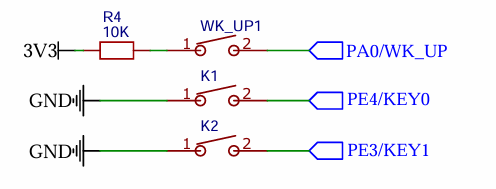

## **基于有限状态机（FSM）的高效非阻塞按键驱动设计**

### 配置定时器

在这里使用的板子是STMF407VET6，同时使用标准库，利用系统软件定时器SYSTICK来进行非阻塞式计时

首先配置好SYSTICK确保每差不多是一进一次中断代表1ms，同时增加一个全局变量进行计时：

```C
SysTick_Config(SystemCoreClock / 1000);
```

在`stm32f4xx_it.c`这个文件中，我们找到`void SysTick_Handler(void)`这个函数，是 **`SysTick`（系统滴答定时器）的中断服务函数**

```C
//加入全局变量 
volatile uint32_t g_msTicks = 0; // 全局毫秒计数器


/**
  * @brief  This function handles SysTick Handler.
  * @param  None
  * @retval None
  */
void SysTick_Handler(void)
{
    g_msTicks++; // 每次调用SysTick_Handler函数，全局毫秒计数器加1
}

/******************************************************************************/
/*                 STM32F4xx Peripherals Interrupt Handlers                   */
/*  Add here the Interrupt Handler for the used peripheral(s) (PPP), for the  */
/*  available peripheral interrupt handler's name please refer to the startup */
/*  file (startup_stm32f4xx.s).                                               */
/******************************************************************************/
```

------

### 硬件初始化与头文件

我们在这里使用了三个按键，分别命名KEY1，KEY2，KEY3。以下是他们的电路：

**KEY1是PA0，KEY2是PE4，KEY3是PE3**



在按键初始化时我们这样进行初始化：

- 首先创建结构体，与计算按键数量

```C
typedef struct
{
	uint32_t rcc; 				//时钟
	GPIO_TypeDef* gpio;  	    //GPIO
	uint16_t pin;  		    	//引脚
	GPIOPuPd_TypeDef pupd; 		//选择上拉下拉
	uint8_t  pressed_level;     //有效电平，可能是0或1
} Key_GPIO_t; 				//按键初始化结构体

static Key_GPIO_t key_gpio_List[] = {
    {RCC_AHB1Periph_GPIOA, GPIOA, GPIO_Pin_0, GPIO_PuPd_DOWN,1}, //KEY1
    {RCC_AHB1Periph_GPIOE, GPIOE, GPIO_Pin_3, GPIO_PuPd_UP,0}, 	//KEY2
    {RCC_AHB1Periph_GPIOE, GPIOE, GPIO_Pin_4, GPIO_PuPd_UP,0}, 	//KEY3
};

#define KEY_NUM_MAX (sizeof(key_gpio_List)/sizeof(key_gpio_List[0])) 	//获取按键数量
```

在这里的设计是为了区分开上面有接地与接VCC导致触发电平不同情况的按键进行设计，加入了“有效电平”与上下拉配置的变量。因为**接VCC的按键一般是高电平与接下拉电阻触发，接GND则相反**。为了方便上层业务的不进行区分，与程序可移植性，如此设计。

同时创建这个`key_gpio_List[]`数组，依次填入三个按键的配置信息，他们就会在数组里面分别对应0，1，2的位置。方便后续设计长按短按双击的逻辑，同时方便后续加入更多按键。

- 接着我们进行硬件初始化

```C
/**
***********************************************************
* @brief 按键硬件初始化
* @param
* @return 
***********************************************************
*/
void Key_DRV_Init(void)
{
	GPIO_InitTypeDef GPIO_InitStructure;
	for(uint8_t i = 0; i < KEY_NUM_MAX; i++)
	{
		RCC_AHB1PeriphClockCmd(key_gpio_List[i].rcc, ENABLE);  	//使能GPIO时钟
		GPIO_InitStructure.GPIO_Pin = key_gpio_List[i].pin; 
		GPIO_InitStructure.GPIO_Mode = GPIO_Mode_IN; 			//普通输入模式
		GPIO_InitStructure.GPIO_Speed = GPIO_Speed_100MHz; 
		GPIO_InitStructure.GPIO_PuPd = key_gpio_List[i].pupd; 

		GPIO_Init(key_gpio_List[i].gpio, &GPIO_InitStructure); 	//初始化GPIO
	}
}
```

利用for循环如此配置，与传统配置不一样。利用结构体变量的优势快速配置。

- 对于头文件，我们编写需要的宏以及函数定义

```C
#ifndef __KEY_H
#define __KEY_H	 
#include "sys.h" 

#define KEY1_SHORT_PRESS   0X01
#define KEY1_DOUBLE_PRESS  0X51
#define KEY1_LONG_PRESS    0X81
#define KEY2_SHORT_PRESS   0X02
#define KEY2_DOUBLE_PRESS  0X52
#define KEY2_LONG_PRESS    0X82
#define KEY3_SHORT_PRESS   0X03
#define KEY3_DOUBLE_PRESS  0X53
#define KEY3_LONG_PRESS    0X83
extern volatile uint32_t g_msTicks;


uint8_t GetKeyVal(void);
void Key_DRV_Init(void);

#endif
```

------

### 按键扫描代码

- 如上，我们继续配置一下结构体

```C
//状态机状态定义
typedef enum
{
	KEY_RELEASE = 0, 	//按键松开
	KEY_CONFIRM,        //按键确认
	KEY_SHORTPRESS,		//短按
    KEY_WAIT_DOUBLE,	//双击
	KEY_LONGPRESS,		//长按
} KEY_STATE;			

//按键信息结构体
typedef struct
{
	KEY_STATE state;	       		//按键状态
	uint32_t prvSysTick;			//按键计时器
	uint8_t  singleClickNum;	  	//短按次数
	uint32_t firstReleseSysTick;	//第一次松开时间
} Key_Info_t;						

static Key_Info_t key_Info_List[KEY_NUM_MAX];		//按键信息数组

#define CONFIRM_TIME   20		//按键消抖.判断短按的时间长度
#define LONGPRESS_TIME 1000	    //按键长按，判断长按的时间长度
#define DOUBLE_CLICK_TIME 250	//双击时间间隔,两次抬起的时间间隔
```

为了管理多个按键，我们构建了 Key_Info_t 结构体，这相当于为每个按键建立了一份“运行档案”。其中 `singleClickNum `用于记录按下的次数，而` firstReleseSysTick `则记录了第一次释放的时间戳，它是区分“单击”与“双击”的关键逻辑支撑。通过这种非阻塞的时间轴对比（基于 `g_msTicks`），系统无需调用任何 delay 函数，极大地提高了CPU 的利用率。

- 实现扫描按键的代码

```C
static uint8_t Key_Scan(uint8_t keyIndex)
{
	volatile uint32_t curSysTick = 0; 
	uint8_t KeyPress = 0;
	KeyPress = GPIO_ReadInputDataBit(key_gpio_List[keyIndex].gpio, key_gpio_List[keyIndex].pin);  
    //读取按键引脚电平    
    
	switch(key_Info_List[keyIndex].state)
	{   
		case KEY_RELEASE:		//按键松开
			if(KeyPress == key_gpio_List[keyIndex].pressed_level)
			{
				key_Info_List[keyIndex].state = KEY_CONFIRM;		//按键确认
				key_Info_List[keyIndex].prvSysTick = g_msTicks;		//记录按键按下时间
			}
			break;
            
		case KEY_CONFIRM:		//按键确认
			if(KeyPress == key_gpio_List[keyIndex].pressed_level)
			{
                curSysTick = g_msTicks;
				if(curSysTick - key_Info_List[keyIndex].prvSysTick >= CONFIRM_TIME)	//消抖
				{
					key_Info_List[keyIndex].state = KEY_SHORTPRESS;		//按键短按
					key_Info_List[keyIndex].prvSysTick = curSysTick;
				}         
			}
			else 
			{
				// 如果是双击的第二下没按稳抖动了，回到等待双击状态；否则回到完全松开
                if(key_Info_List[keyIndex].singleClickNum == 1)
                    key_Info_List[keyIndex].state = KEY_WAIT_DOUBLE;
                else
				    key_Info_List[keyIndex].state = KEY_RELEASE;
			}
			break;
            
		case KEY_SHORTPRESS:	//按键短按
			if(KeyPress != key_gpio_List[keyIndex].pressed_level) //没有按住
			{
			    key_Info_List[keyIndex].singleClickNum++; // 记录按下次数

                if(key_Info_List[keyIndex].singleClickNum == 1) 
                {
                    // 第一次松手：进入等待期，看有没有第二下
                    key_Info_List[keyIndex].state = KEY_WAIT_DOUBLE;
                    key_Info_List[keyIndex].firstReleseSysTick = g_msTicks; // 记录第一次松手的时间
                }
                else if(key_Info_List[keyIndex].singleClickNum == 2)
                {
                    // 第二次松手：确认为双击
                    key_Info_List[keyIndex].state = KEY_RELEASE;
                    key_Info_List[keyIndex].singleClickNum = 0; // 计步器清零
                    return (uint8_t)(keyIndex + 0x51); 
                }
			}
			else
			{
			    curSysTick = g_msTicks;
				if(key_Info_List[keyIndex].singleClickNum == 0 && 
                   (curSysTick - key_Info_List[keyIndex].prvSysTick >= LONGPRESS_TIME))	//长按时间窗
				{
					key_Info_List[keyIndex].state = KEY_LONGPRESS;                  
				}
			}
			break;

		 case KEY_WAIT_DOUBLE:   
            if(KeyPress == key_gpio_List[keyIndex].pressed_level) // 在等待期内又按下
            {
                key_Info_List[keyIndex].state = KEY_CONFIRM; // 去消抖第二下
                key_Info_List[keyIndex].prvSysTick = g_msTicks;
            }
            else // 在等待期内一直没按
            {
				curSysTick = g_msTicks;
                if(curSysTick - key_Info_List[keyIndex].firstReleseSysTick > DOUBLE_CLICK_TIME)
                {
                    // 超时了,说明刚才那就是个单击
                    key_Info_List[keyIndex].state = KEY_RELEASE;
                    key_Info_List[keyIndex].singleClickNum = 0; // 计步器清零
                    return (uint8_t)(keyIndex + 1); 
                }
            }
            break;
            
		case KEY_LONGPRESS:		//按键长按
			if(KeyPress != key_gpio_List[keyIndex].pressed_level)	//没有按住
			{
			    key_Info_List[keyIndex].state = KEY_RELEASE;		//按键松开
				return (uint8_t)(keyIndex + 0x81);					//返回按键值,对应0x81 0x82 0x83
			}
			break;
            
		default:
			key_Info_List[keyIndex].state = KEY_RELEASE;		//按键松开
			key_Info_List[keyIndex].singleClickNum = 0;
			break;
	}
	return 0;
}
```

在这里有一个比较巧妙的设计，因为KEY1，2，3的刚好对于前面数组中下彪的0，1，2。触发短按代码是`return (uint8_t)(keyIndex + 1); `，这样刚好对应短按三个宏定义是0x01,0x02,0x03，那么0就是没有按键被按下的情况。

同时这里是设计了一个有限状态机进行处理，流程图如下：

.png)


### 按键获取代码

```C
/**
***********************************************************
* @brief 获取按键码值
* @param
* @return 三个按键码值，短按0x01 0x02 0x03，
			长按0x81 0x82 0x83，没有按下为0
***********************************************************
*/
uint8_t GetKeyVal(void)
{
	uint8_t res = 0;
	for (uint8_t i = 0; i < KEY_NUM_MAX; i++)
	{
		res = Key_Scan(i);
		if(res != 0)
		{
			break;		//检测到按键，跳出循环
		}
	}
	return res;			//返回按键值
}
```

这个函数作为一个对外调用的一个接口，返回相应的按键码值。

### 使用实例

这里使用这个按键代码进行控制灯，使用实例如下：

```C
int main(void)
{ 
   
    uart_init(115200);
  	SysTick_Config(SystemCoreClock / 1000);
	Print_System_Clocks();
    
	uint8_t key_val = 0;
	LED_Init();				//初始化LED端口
	LED0=1;				  	//先点亮红灯
	Key_DRV_Init();	//初始化按键驱动


	while(1)
	{
		key_val = GetKeyVal();		//得到键值
		switch(key_val)
		{
			case KEY2_DOUBLE_PRESS:
				LED0=!LED0;
				break;
			case KEY2_LONG_PRESS:
				LED1=!LED1;
				break;
			case KEY1_DOUBLE_PRESS:
				LED0=!LED0;
				break;
			case KEY1_LONG_PRESS:
				LED1=!LED1;
				break;
			case KEY3_DOUBLE_PRESS:
				LED0=!LED0;
				break;
			case KEY3_LONG_PRESS:
				LED1=!LED1;
				break;
		}
	}
}
```

