# TJC_HMI_Lib 详细架构图

---

## 1. 库整体架构（三层结构）

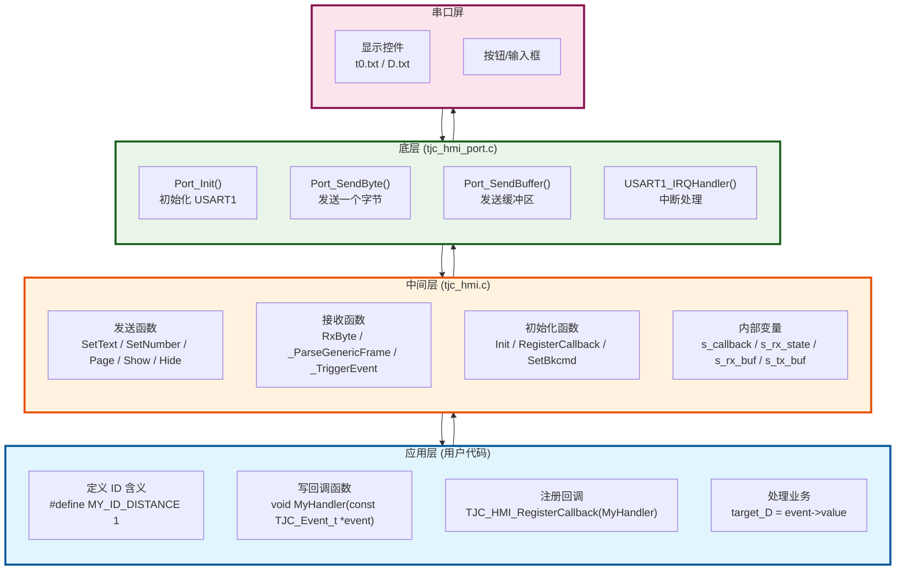

---

## 2. 接收状态机详解

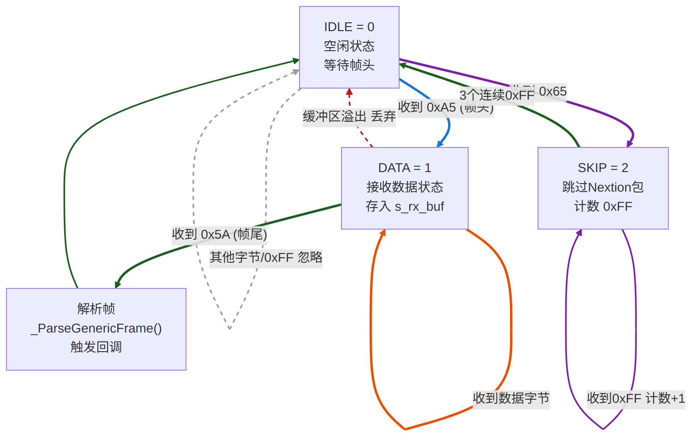

---

## 3. 帧格式与解析详解

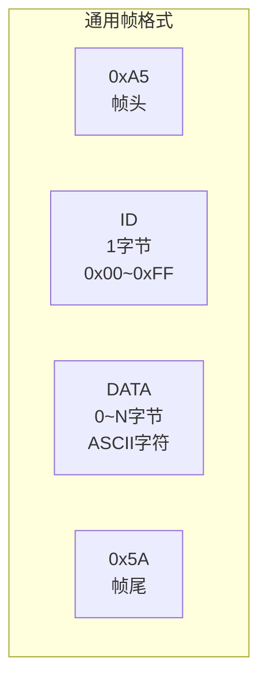

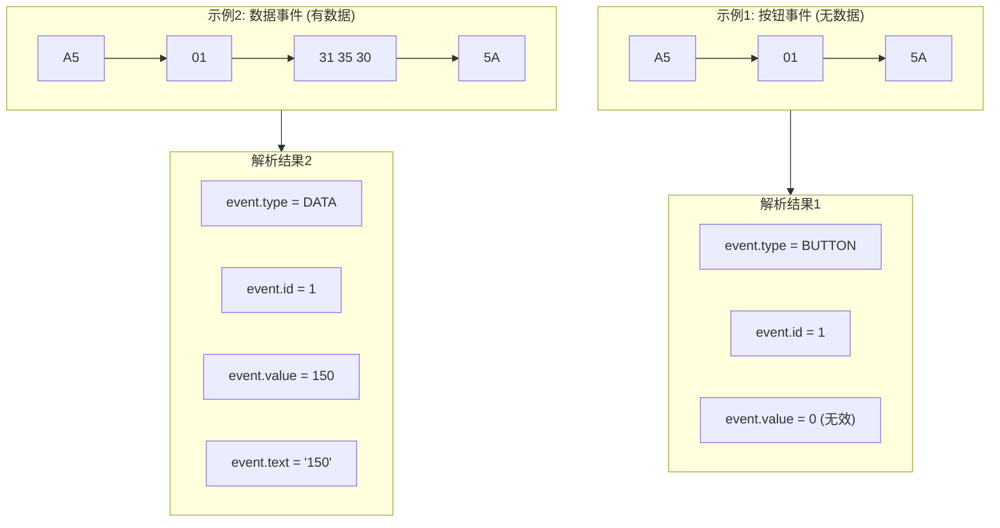

---

## 4. 事件结构体详解

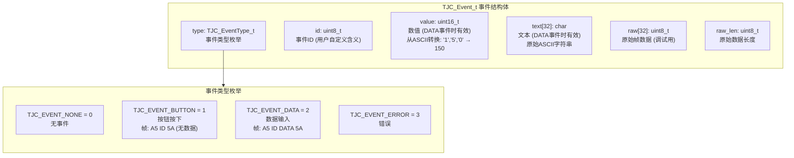

---

## 5. 回调函数机制详解

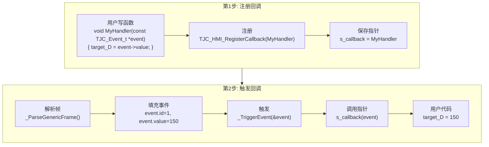

---

## 6. 发送流程详解

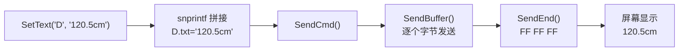

---

## 7. 接收流程详解

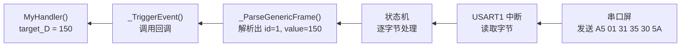

---

## 8. 内部变量详解

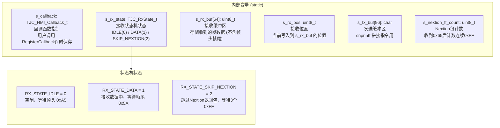

---

## 9. 函数调用关系

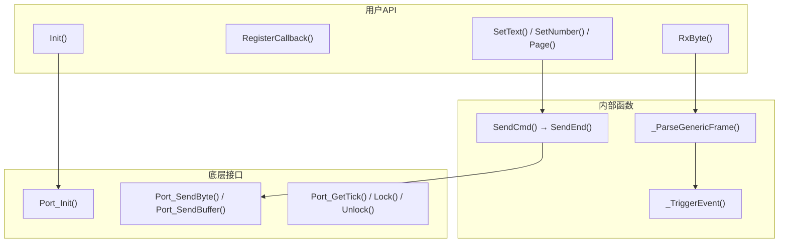

---

## 10. 配置项详解 (tjc_hmi_config.h)

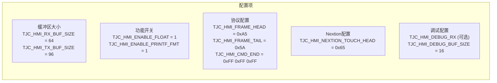
