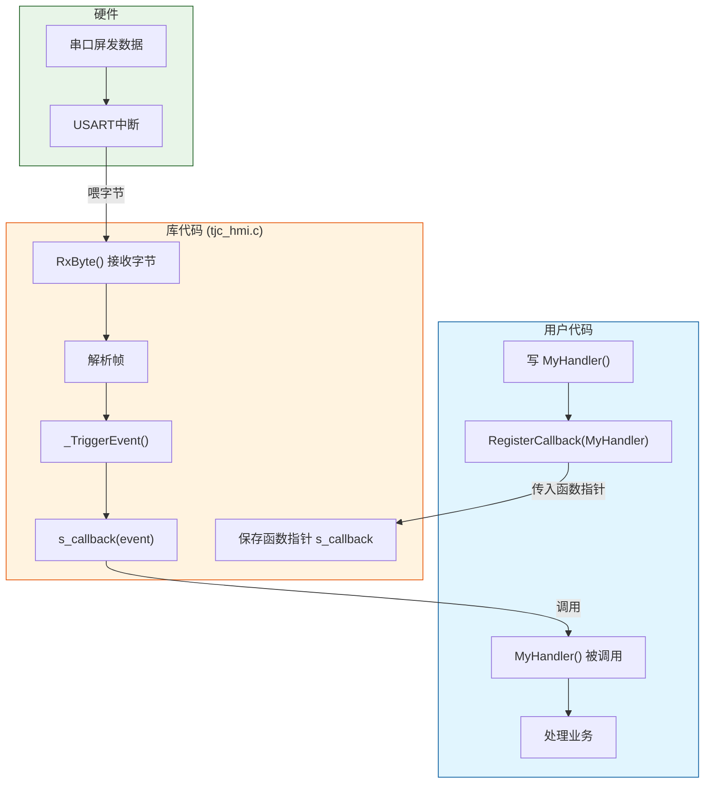
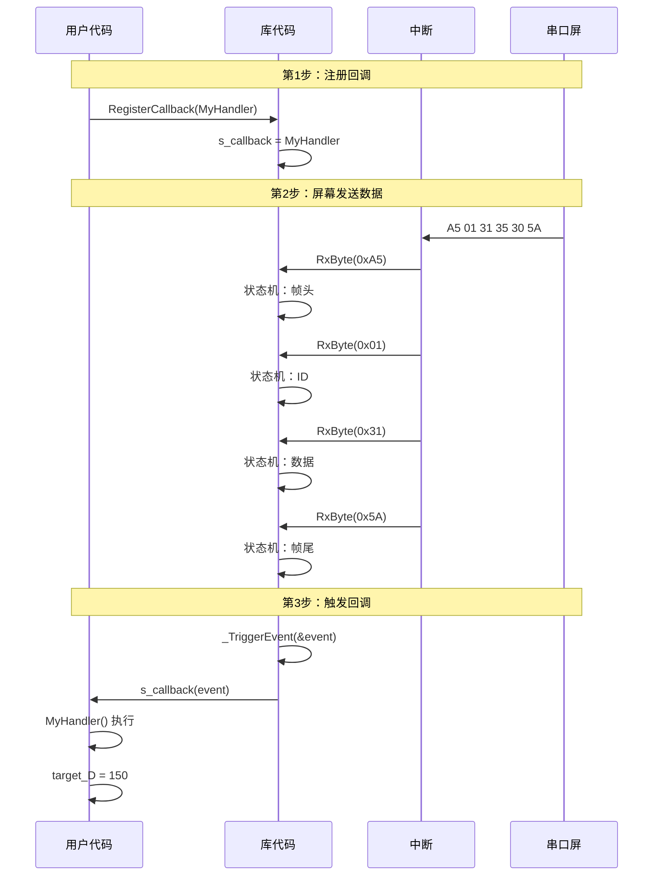
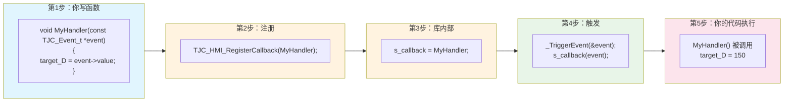

# TJC_HMI_Lib 回调函数机制详解

## 什么是回调函数

回调函数就是**你写的处理函数，库在特定时机自动调用它**。

类比理解：
- 你把电话号码留给快递柜 → `RegisterCallback(MyHandler)`
- 快递柜有快递时打电话给你 → `_TriggerEvent(event)`
- 你接电话去取快递 → `MyHandler()` 被调用

## 两个关键函数

| 函数 | 谁调用 | 作用 |
|------|--------|------|
| `RegisterCallback(MyHandler)` | 你 | 告诉库"我的函数在这" |
| `_TriggerEvent(event)` | 库内部 | 有数据时通知你，调用你的函数 |

## 执行流程

```
屏幕发数据 → 中断读字节 → 库解析帧 → _TriggerEvent() → MyHandler() 执行
```

## 代码示例

```c
// 第1步：你写回调函数
void MyHandler(const TJC_Event_t *event)
{
    target_D = event->value;  // 处理业务
}

// 第2步：注册回调
TJC_HMI_RegisterCallback(MyHandler);

// 第3步：库内部自动调用（你看不见）
// _TriggerEvent(&event) → s_callback(event) → MyHandler() 执行
```

## 回调函数流程图



## 详细执行流程



## 代码对照表



## 总结

| 概念 | 函数 | 谁调用 | 作用 |
|------|------|--------|------|
| 注册回调 | `RegisterCallback()` | 用户 | 告诉库"我的函数在这" |
| 触发回调 | `_TriggerEvent()` | 库内部 | 有数据时通知用户 |
| 回调函数 | `MyHandler()` | 库调用，用户写 | 处理业务逻辑 |

**一句话：** 你写函数，注册它，库有数据时自动调用它。
